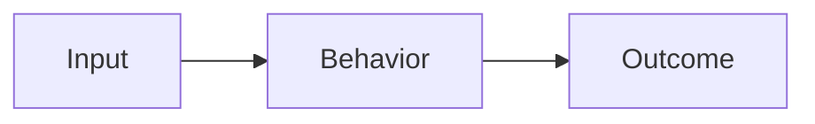

# Plan: <feature name>

> **Status:** Draft until the Plan validator returns `VALID`.

## Problem Statement

<Observed problem and intended outcome>

## Personas

<Affected personas and impact>

## Value Assessment

<Customer, efficiency, and future value>

## User Stories

<User stories without acceptance criteria nested below them>

## Design

Visual disposition: `<none|runtime_capture|generative_mockup>`

Scope inventory SHA-256: `<64 lowercase hex characters>`

For `runtime_capture`, list current runtime evidence. For `generative_mockup`, include:

Final mockup: <durable HTTPS URL>

Final mockup SHA-256: `<64 lowercase hex characters>`

## Acceptance Criteria

- WHEN <trigger> THEN the system SHALL <observable behavior>.
- IF <condition> THEN the system SHALL <observable behavior>.

## Tasks

- [ ] **T-001 — <Task title>.** Objective: <bounded outcome>. Context: <why and constraints>.
  Affected modules: `<path or module>`. Requirements: <observable behavior>. Verification:
  <targeted and canonical checks>. Complete when: <handoff condition>. Owner lane: <lane>.
  `depends_on: []`.

## Out of Scope

- <Explicit non-goal>

## Mockup Accounting Matrix

| Visual or Scope Requirement | Acceptance Criterion | Task | Verification |
| --- | --- | --- | --- |
| <Normative element> | <Criterion> | <Task> | <Test or inspection> |

## Cross-Reference

Research: <exact research issue URL>
