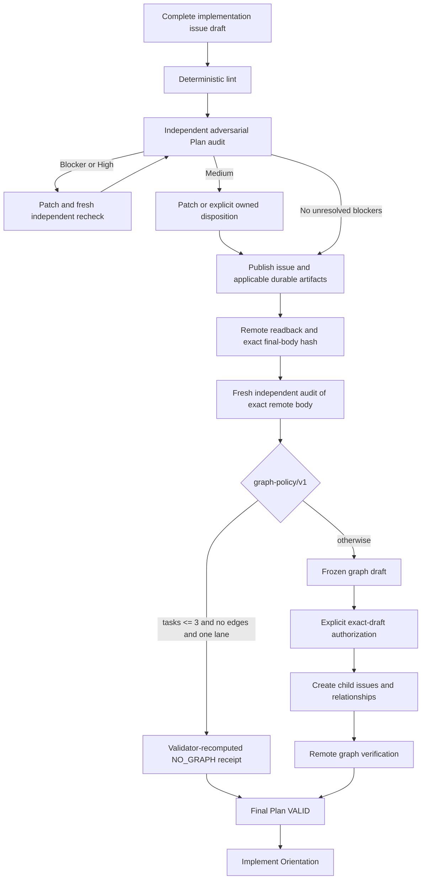
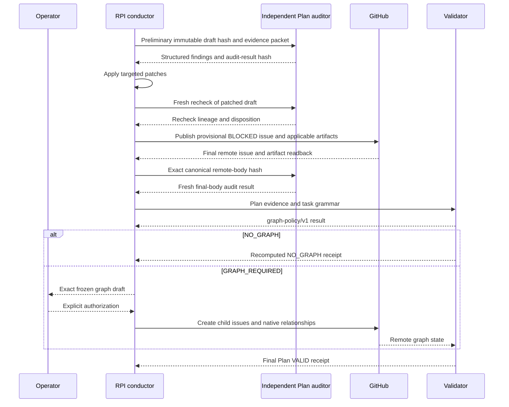

# Plan: Add Hi-fi Planning Gates to Evidence-Gated Delivery

> **Status:** Plan validation pending; implementation has not started.

## Problem Statement

Evidence-Gated Delivery already treats a GitHub implementation issue as Plan authority and uses
independent audits, transition judges, durable artifacts, and validator receipts. It does not yet
make the strongest parts of the current `lousy-agents/skills` Hi-fi Planning composition explicit:
a structured adversarial plan-audit loop and a remotely verified native GitHub task graph.

The update must add those controls without creating `.github/specs/**`, weakening existing phase
gates, trusting manifest assertions, or turning every small plan into issue sprawl. The
implementation issue remains the sole normative Plan artifact.

## Personas

- **Workflow operator:** needs a deterministic answer about whether a Plan is ready, why it is
  blocked, and which protected mutation still needs approval.
- **Implementation agent:** needs stable task IDs, explicit dependencies, complete task context, and
  an unambiguous handoff.
- **Independent auditor:** needs a bounded finding schema, immutable inputs, and proof that fixes
  received a fresh independent recheck.
- **Repository maintainer:** needs portable bundled skills, regression tests, recoverable GitHub
  writes, and no silent weakening of existing gates.

## Value Assessment

Primary value is higher-confidence implementation handoff: semantic plan defects are fixed before
execution, and sufficiently complex plans gain native GitHub sequencing that can be remotely
verified. Secondary value is compound engineering: each failure mode becomes a validator rule,
fixture, or reusable skill so future runs improve.

The main cost is additional Plan work and, when policy requires it, additional GitHub issues.
`graph-policy/v1` limits that cost by allowing a validator-recomputed no-graph disposition only for
plans with at most three tasks, zero dependency edges, and one owner lane.

## User Stories

- As a workflow operator, I want deterministic Plan gates so that phase status cannot depend on an
  agent's self-report.
- As an implementation agent, I want stable task identities and explicit dependencies so that I can
  sequence work without reverse-engineering prose.
- As an auditor, I want findings with evidence, severity, patches, and recheck lineage so that a
  closed finding is demonstrably remediated.
- As a maintainer, I want graph writes drafted and separately authorized so that partial or
  duplicate external mutations fail closed.
- As a skill consumer, I want all reusable dependencies bundled and sync-tested so that the public
  workflow is portable.

## Design

### Visual artifact applicability gate

Before screenshots, visual briefs, or ImageGen calls, the conductor and validator evaluate
`visual-applicability/v1`. The final disposition is `VISUAL_REQUIRED` or
`VISUAL_NOT_APPLICABLE`, with a validator-recomputed evidence mode:

- `none`: no scoped visual surface; no screenshot or ImageGen work;
- `runtime_capture`: an existing UI is relevant, but screenshots, DOM/accessibility inspection, or
  visual-regression evidence can verify it without generating a design; or
- `generative_mockup`: a new or substantially redesigned visual concept, visual deliverable, or
  explicit ImageGen exploration requires generated alternatives and a normative final mockup.

There is no speculative “nice to have” generation path.

`VISUAL_REQUIRED` applies when at least one scoped trigger is proven:

1. the requested deliverable is itself visual, such as a product mockup, image, presentation,
   marketing asset, diagram whose appearance is being evaluated, or visual report;
2. the planned change creates or materially changes a user-visible web, mobile, desktop, game, or
   embedded interface;
3. acceptance criteria depend on spatial layout, styling, hierarchy, interaction flow, component
   states, animation, responsive behavior, or visual accessibility behavior; or
4. the user explicitly asks for an ImageGen artifact or visual design exploration.

The validator selects `runtime_capture` for bounded changes to an existing interface—such as copy,
ARIA semantics, focus behavior, an existing component state, or a CSS regression—when current
runtime evidence can fully verify the acceptance criteria. It selects `generative_mockup` only for
a new screen or component concept, substantial layout/hierarchy/styling/interaction redesign,
marketing or other inherently visual asset, or explicit ImageGen exploration.

`VISUAL_NOT_APPLICABLE` applies when no required trigger is present and the scoped change is limited
to nonvisual behavior such as backend APIs, CLI behavior, libraries, validators, automation,
CI/CD, infrastructure, migrations, data contracts, security rules, observability configuration, or
process documentation. A frontend elsewhere in the repository is insufficient: the scoped files,
contracts, or acceptance criteria must actually affect that frontend. README or architecture
documentation defaults to prose, tables, and Mermaid; it does not justify ImageGen unless visual
appearance is itself a deliverable.

The decision is evidence-backed, not intuitive guesswork. The validator derives a complete,
hash-bound scope inventory from the immutable user direction, every authoritative acceptance
criterion, every task and `affected modules` entry, repository classification evidence, and—during
Review—the actual changed paths and runtime surfaces. Every task and affected module has exactly
one visual classification and provenance reference. `VISUAL_NOT_APPLICABLE` requires positive,
complete nonvisual coverage; an empty trigger list, unknown path, omitted task/module, or
unclassifiable scope is not sufficient.

Evaluation order is deterministic:

1. normalize all scoped visual directions by authority, scope, and source order: a clearly scoped
   newer user direction supersedes an older user direction for the same deliverable unless doing so
   would waive acceptance-critical evidence; simultaneous, same-turn, equally authoritative, or
   otherwise unresolved opt-in/opt-out conflict enters `BLOCKED_PENDING_VISUAL_CLARIFICATION`
   before any screenshot or ImageGen call;
2. an effective explicit ImageGen or visual-exploration request selects `VISUAL_REQUIRED` with
   `generative_mockup`;
3. an acceptance-critical visual deliverable or proven scoped visual trigger selects
   `VISUAL_REQUIRED`, then the validator chooses `runtime_capture` when existing-runtime evidence
   is sufficient and `generative_mockup` otherwise;
4. effective explicit no-ImageGen direction suppresses optional generation but cannot waive
   acceptance-critical visual evidence; a conflict enters transient
   `BLOCKED_PENDING_VISUAL_CLARIFICATION`;
5. complete proven nonvisual scope selects `VISUAL_NOT_APPLICABLE` with `none`;
6. material ambiguity—meaning the unresolved choice could change acceptance criteria, affected
   components, evidence mode, or the deliverable—enters the same blocking clarification state; and
7. nonmaterial ambiguity selects the otherwise supported disposition with uncertainty and
   rationale recorded.

The blocking clarification state is not a third final disposition. Replaying identical evidence
must produce the same result.

Visual receipts are phase-bound rather than reused:

- Plan binds the disposition to the authoritative issue hash and complete planned-scope inventory.
- Implement Orientation recomputes it from the approved task set and intended changed paths before
  mutation.
- Review recomputes it from the actual diff, changed paths, runtime surfaces, and acceptance
  criteria.

A newly detected visual trigger upgrades the mode and blocks progress until the newly applicable
evidence gates pass; a stale Plan receipt cannot satisfy Implement or Review.

For `runtime_capture`, contestants and judges remain concept-only, while current runtime
screenshots/DOM/accessibility or visual-regression evidence is captured and reviewed as applicable.
For `generative_mockup`, the existing screenshot grounding, contestant images, final-winner image,
semantic visual review, durable publication, mockup accounting, and implementation visual
comparison remain mandatory. For `none`, contestants submit reasoned concepts without visual
briefs, image arrays and final image URL remain empty, mockup publication and visual review are
omitted, and the issue contains a validator-recomputed disposition matrix instead of pretending an
image exists. `preflight_plan.py`, `validate_run.py`, Plan Exit, Implement Orientation, and Review
all branch on the current phase-bound receipt.

For this initiative, the applicable evidence is validators, skills, manifests, GitHub issue
contracts, and tests; no product frontend or visual deliverable is in scope. Under
`visual-applicability/v1`, the correct decision is `VISUAL_NOT_APPLICABLE` with mode `none`. The
generated images in the run history are rejected exploratory evidence and are not normative Plan
artifacts.

| Task | Scope evidence | Classification | Provenance |
|---|---|---|---|
| T-001 | Manifest, event, policy, authorization, and receipt schemas | Nonvisual contract | Task affected-modules and schema criteria |
| T-002 | Validator and deterministic lint | Nonvisual behavior | Task affected-modules and audit criteria |
| T-003 | Portable Plan-auditor skill and packaging | Nonvisual process/tooling | Task affected-modules and portability criteria |
| T-004 | Task parser and graph policy | Nonvisual behavior | Task affected-modules and graph criteria |
| T-005 | GitHub issue-graph skill and command transaction | Nonvisual automation | Task affected-modules and authorization criteria |
| T-006 | Remote issue-graph verification and recovery | Nonvisual automation | Task affected-modules and recovery criteria |
| T-007 | RPI orchestration, receipts, and documentation | Nonvisual process documentation | Task affected-modules and phase-gate criteria |
| T-008 | Tests, packaging, provenance, and regression safety | Nonvisual verification | Task affected-modules and quality criteria |
| T-009 | Visual applicability policy and validator branching | Nonvisual validator logic | Task affected-modules and applicability criteria |

The table above is the reader view of a canonical scope inventory. The validator expands the
authoritative issue into independently addressable entries and proves exact-set equality before it
may emit mode `none`:

| Source domain | Required inventory IDs | Count | Classification for this initiative |
|---|---|---:|---|
| Scoped deliverable | `D-001` | 1 | Nonvisual workflow and validator contract |
| Effective user direction | `UD-001` | 1 | Avoid unnecessary generated images for nonvisual scope |
| Acceptance criteria | `AC-001` through `AC-040` | 40 | Nonvisual observable validator/workflow behavior |
| Tasks | `T-001` through `T-009` | 9 | Nonvisual implementation work |
| Affected-module entries parsed from tasks | `M-001` through `M-039` | 39 | Nonvisual scripts, contracts, skills, packaging, docs, and tests |

Each acceptance criterion carries its stable `AC-NNN` marker below. For module entries, the parser
splits every task's `Affected modules` clause in source order, assigns `M-NNN`, retains the exact
source text and task ID, classifies it, and records its provenance. The receipt contains the
canonical inventory SHA-256 plus source-domain counts. Any omitted, duplicate, extra, unknown, or
unclassified source ID, or any mismatch between parsed source counts and receipt counts, blocks
mode `none`. Grouped reader rows are never accepted without this exact validator expansion.

### Authority and state model

The GitHub implementation issue is the sole permanent Plan authority. Local drafts and any
provisional `BLOCKED` issue used to publish applicable artifacts are transaction inputs, not
validated specifications. After reciprocal links and every disposition-required artifact are
present, the validator canonicalizes and hashes the remotely read issue body. An artifact URL is
required only for `generative_mockup`; reciprocal Research/Plan links and exact remote-body hashing
are unconditional. The independent semantic audit and any recheck must cover that exact final
canonical hash. Any later substantive issue edit invalidates the audit and requires a fresh
independent recheck. The canonicalization contract may normalize only explicitly enumerated
transport differences such as line endings; it may not ignore URLs, criteria, tasks, or
relationships.

The workflow records append-only, hash-chained Plan events; intermediate `CHECKPOINT_VALID`
receipts are diagnostic and never substitute for the validator's phase `VALID` receipt.

New runs select an immutable `plan_protocol_version` during `init_run.py`. The new audit and graph
contract is `plan-protocol/v2`; it cannot be omitted or downgraded after initialization. Existing
manifests retain their recorded legacy contract when resumed, unsupported versions fail closed,
and migration to v2 requires an explicit migration command that preserves the prior event chain.

Plan proceeds through:

1. complete issue draft with stable task grammar;
2. deterministic lint and a preliminary independent adversarial audit;
3. finding remediation plus a fresh independent recheck;
4. provisional blocked issue, applicable durable artifacts, reciprocal-link publication, and
   remote readback;
5. final-body hash binding plus a fresh independent audit of the exact remote body;
6. validator-recomputed `graph-policy/v1` decision;
7. either a recomputed `NO_GRAPH` receipt or a frozen graph draft;
8. explicit authorization of the exact graph draft before any child-issue write;
9. collision-safe child issue and relationship creation with remote verification; and
10. final Plan `VALID`, followed by Implement Orientation.

### Structured Plan audit

Add a bundled `plan-auditor` skill and deterministic lint. Every semantic finding has a stable ID,
severity (`Blocker`, `High`, `Medium`, or `Low`), confidence, exact evidence, one bounded
clarification question when needed, a targeted patch, verification implications, and downstream
instructions. `Blocker` and `High` findings block Plan; after a patch they require a fresh
independent recheck. Every `Medium` finding must be patched or explicitly accepted/deferred with an
owner and rationale.

Each semantic audit or remediation recheck uses a newly authenticated
`independent-plan-spec-auditor` session that is distinct from the patch author, contestants, Plan
judges, phase execution auditor, transition judge, and every predecessor Plan-auditor session. Its
receipt binds the role marker, reviewed-body hash, predecessor audit and finding IDs, callback
equality, result hash, and timestamps. The validator authenticates this from the actual
collaboration-delegated parent/child traces and recomputes hashes and dispositions.

### Stable task grammar and graph policy

Each task has a stable ID (`T-NNN`), objective, context, affected modules, requirements,
verification, completion condition, owner lane, and an explicit `depends_on` list. Dependencies
refer only to stable task IDs; prose inference is forbidden.

`graph-policy/v1` is deterministic:

- `NO_GRAPH` only when task count is at most 3, dependency edge count is 0, and distinct owner-lane
  count is 1.
- `GRAPH_REQUIRED` otherwise.

The validator parses the authoritative issue, recomputes all three inputs, and tests representative
boundary fixtures. Agents cannot choose a disposition.

### Protected graph transaction and recovery

The implementation issue is always the graph parent. A bundled `plan-to-graph` skill prepares an
exact draft containing child titles, full bodies, stable task IDs, parent identity, and dependency
edges. Publication is a separate protected external mutation and requires explicit authorization
of that exact draft.

Before drafting or writing, a read-only capability preflight verifies the authenticated GitHub
identity, exact repository and parent issue, supported `--parent` and `--add-blocked-by`
operations, and availability of the required remote readback fields. The authorization binds that
identity, repository, parent, capability receipt, frozen draft SHA, child bodies, and edges.
Identity, repository, parent, capability, or draft drift invalidates authorization before mutation.

Before writing, the workflow searches for stable task markers and refuses collisions. Each
successful write is recorded immediately. Recovery classifies remote state deterministically:

- **Exact authorized match:** reuse the existing child or relationship.
- **Authorized missing item:** resume only when all existing remote state is an exact subset of the
  same authorized draft.
- **Conflict or extra item:** body-hash, parent, stable-marker, or edge disagreement stays
  `BLOCKED`; freeze a new draft and obtain explicit reauthorization.

Unknown or extra remote artifacts are never edited or deleted automatically. Final validation
remotely reads back parent/sub-issue membership and blocking relationships.

### Portability, privacy, and compatibility

Bundle `plan-auditor` and `plan-to-graph`, declare them in `skills.sh.json`, and extend install-sync
verification. Port the collaboration-delegated audit evidence contract and its tests from the
installed workflow into the repository so Desktop child-agent traces can be authenticated without
manifest-only assertions. Public issues and receipts contain only privacy-safe task metadata,
public identifiers, timestamps, and cryptographic hashes—never secrets, private prompts, or PII.

Existing Research, Plan, Implement, transition, retrospective, and protected-write gates remain
fail closed. No product runtime, migration, or feature flag is introduced. Rollout activates v2
only for newly initialized or explicitly migrated runs; legacy resumes retain their recorded
protocol. Rollback is a code revert before graph publication. Published graph artifacts are
reconciled, not destructively deleted, if a later software rollback occurs.

This change adds no runtime UI. The prose, tables, and Mermaid diagrams are the accessible
normative representation. Interactive behavior, runtime visual data mapping, and responsive
application behavior are not applicable.

## Acceptance Criteria

- WHEN a Plan candidate is linted, THE SYSTEM SHALL emit deterministic structural findings tied to the candidate content hash. <!-- AC-001 -->
- WHEN an independent Plan auditor reports a Blocker or High finding, THE SYSTEM SHALL prevent final Plan validation until a targeted patch receives a fresh independent recheck. <!-- AC-002 -->
- WHEN an independent Plan auditor reports a Medium finding, THE SYSTEM SHALL require either a verified patch or an explicit owner, rationale, and disposition. <!-- AC-003 -->
- WHEN Plan audit evidence is presented, THE VALIDATOR SHALL authenticate a fresh auditor session distinct from all authoring, contestant, judge, phase-auditor, transition-judge, and predecessor-auditor sessions and SHALL verify its role, exact remote-body hash, result hash, callback equality, and remediation lineage from durable trace evidence. <!-- AC-004 -->
- WHEN the final implementation issue is read remotely, THE VALIDATOR SHALL canonicalize its body under the enumerated transport-only rules and SHALL require its hash to equal the body hash reviewed by the final independent Plan auditor. <!-- AC-005 -->
- IF a substantively different implementation-issue body is observed after audit, THE SYSTEM SHALL invalidate the audit and SHALL require a fresh independent recheck. <!-- AC-006 -->
- WHEN the authoritative issue contains tasks, THE VALIDATOR SHALL parse stable task IDs, owner lanes, and explicit dependency IDs without inferring dependencies from prose. <!-- AC-007 -->
- WHEN task count is at most three, dependency edge count is zero, and owner-lane count is one, THE VALIDATOR SHALL emit a recomputed `NO_GRAPH` receipt under `graph-policy/v1`. <!-- AC-008 -->
- WHEN any `graph-policy/v1` no-graph condition is false, THE SYSTEM SHALL classify the Plan as `GRAPH_REQUIRED`. <!-- AC-009 -->
- WHILE a required graph lacks explicit authorization binding the exact identity, repository, parent, capability receipt, frozen draft, child bodies, and edges, THE SYSTEM SHALL prohibit child-issue and relationship mutations. <!-- AC-010 -->
- WHEN a required graph is authorized, THE SYSTEM SHALL use the implementation issue as parent and preserve each task's complete structured context in one child issue. <!-- AC-011 -->
- IF remote graph state is an exact subset of the same authorized draft, THE SYSTEM SHALL reuse exact matches and SHALL resume only the authorized missing items. <!-- AC-012 -->
- IF a stable task marker, body hash, parent, edge, or extra-artifact conflict is detected, THE SYSTEM SHALL stop without creating, editing, or deleting remote artifacts and SHALL require a newly frozen draft plus explicit reauthorization. <!-- AC-013 -->
- WHEN graph publication completes, THE VALIDATOR SHALL remotely verify every child identity, parent link, dependency relationship, and recorded action before issuing final Plan `VALID`. <!-- AC-014 -->
- WHEN a checkpoint receipt exists without the final phase receipt, THE SYSTEM SHALL continue to report the Plan as not `VALID`. <!-- AC-015 -->
- WHEN the workflow is installed, THE SYSTEM SHALL include the bundled `plan-auditor` and `plan-to-graph` skills and SHALL verify their packaged copies remain synchronized. <!-- AC-016 -->
- WHEN a collaboration-delegated audit receipt is validated, THE VALIDATOR SHALL cross-check the parent delegation event, child UUID session, role marker, callback equality, timestamps, and result hash. <!-- AC-017 -->
- WHILE public artifacts are written, THE SYSTEM SHALL exclude secrets, private prompts, PII, and unsupported performance or quality claims. <!-- AC-018 -->
- IF graph publication or remote readback fails after a partial write, THE SYSTEM SHALL enter `BLOCKED` and SHALL resume only after remote-state reconciliation without destructive cleanup. <!-- AC-019 -->
- WHEN a new run is initialized, THE SYSTEM SHALL record immutable `plan_protocol_version: plan-protocol/v2`; IF a legacy run is resumed, THE SYSTEM SHALL retain its recorded contract unless an explicit event-preserving migration is performed. <!-- AC-020 -->
- IF an unsupported or downgraded Plan protocol version is observed, THE VALIDATOR SHALL fail closed. <!-- AC-021 -->
- WHEN a run begins Plan, THE VALIDATOR SHALL recompute `visual-applicability/v1` from the scoped deliverable, affected surfaces, paths, components, acceptance criteria, and explicit user direction before any screenshot or ImageGen call. <!-- AC-022 -->
- WHEN scoped visual directions are evaluated, THE VALIDATOR SHALL normalize their authority, scope, and source order before evaluating any visual trigger. <!-- AC-023 -->
- WHEN a clearly scoped newer user direction supersedes an older direction for the same deliverable, THE VALIDATOR SHALL use the newer direction unless it would waive acceptance-critical evidence. <!-- AC-024 -->
- IF simultaneous, same-turn, equally authoritative, or otherwise unresolved opt-in and opt-out directions conflict, THE SYSTEM SHALL enter `BLOCKED_PENDING_VISUAL_CLARIFICATION` before any screenshot or ImageGen call. <!-- AC-025 -->
- WHEN the requested deliverable is visual, the scoped change affects a user-visible interface, visual behavior is acceptance-critical, or the effective user direction requests visual exploration, THE SYSTEM SHALL classify the run as `VISUAL_REQUIRED`. <!-- AC-026 -->
- WHEN an existing interface can be fully verified through current screenshots, DOM/accessibility inspection, or visual-regression evidence, THE VALIDATOR SHALL select `runtime_capture` and SHALL NOT require ImageGen. <!-- AC-027 -->
- WHEN the scope creates a new visual concept, substantially redesigns layout, hierarchy, styling, or interaction, produces an inherently visual asset, or effectively requests ImageGen exploration, THE VALIDATOR SHALL select `generative_mockup`. <!-- AC-028 -->
- WHEN no visual trigger is present and the scoped change is limited to nonvisual code, contracts, automation, infrastructure, data, or process documentation, THE SYSTEM SHALL classify the run as `VISUAL_NOT_APPLICABLE`. <!-- AC-029 -->
- WHEN a repository contains a frontend outside the scoped change, THE SYSTEM SHALL NOT use that unrelated frontend as evidence that a visual is required. <!-- AC-030 -->
- WHEN documentation can express the required relationship through prose, a table, or Mermaid and visual appearance is not itself a deliverable, THE SYSTEM SHALL default to `VISUAL_NOT_APPLICABLE`. <!-- AC-031 -->
- WHEN scope evidence is incomplete or an affected task, module, path, runtime surface, or acceptance criterion is unclassified, THE VALIDATOR SHALL block rather than emit `VISUAL_NOT_APPLICABLE`. <!-- AC-032 -->
- WHEN effective no-ImageGen direction conflicts with an acceptance-critical visual deliverable, THE SYSTEM SHALL enter `BLOCKED_PENDING_VISUAL_CLARIFICATION` and SHALL NOT treat the direction as a waiver. <!-- AC-033 -->
- IF visual applicability ambiguity could change acceptance criteria, affected components, evidence mode, or the deliverable, THE SYSTEM SHALL block for clarification; OTHERWISE THE SYSTEM SHALL record the nonmaterial uncertainty and SHALL use the otherwise proven disposition. <!-- AC-034 -->
- WHEN `VISUAL_NOT_APPLICABLE` with mode `none` is valid, THE VALIDATOR SHALL require empty contestant-image and final-image receipts, SHALL omit mockup publication and visual-review gates, and SHALL verify complete positive nonvisual coverage in the disposition matrix. <!-- AC-035 -->
- WHEN `VISUAL_REQUIRED` with mode `runtime_capture` is valid, THE SYSTEM SHALL require current runtime, DOM/accessibility, or visual-regression evidence sufficient for the criteria and SHALL omit ImageGen-specific gates. <!-- AC-036 -->
- WHEN `VISUAL_REQUIRED` with mode `generative_mockup` is valid, THE SYSTEM SHALL preserve all screenshot grounding, semantic review, durable publication, mockup accounting, accessibility, and implementation visual-comparison gates. <!-- AC-037 -->
- WHEN Implement Orientation begins, THE VALIDATOR SHALL recompute visual applicability from the approved tasks and intended changed paths and SHALL reject a stale Plan receipt. <!-- AC-038 -->
- WHEN Review begins, THE VALIDATOR SHALL recompute visual applicability from the actual diff, changed paths, runtime surfaces, and acceptance criteria and SHALL upgrade and block on any newly detected visual trigger. <!-- AC-039 -->
- WHEN bundled skills incorporate source-derived material, THE SYSTEM SHALL record the copy-versus-reimplementation decision and SHALL preserve every applicable BSD-2-Clause notice or attribution. <!-- AC-040 -->

## Tasks

- [ ] **T-001 — Freeze contracts and schemas.** Objective: define Plan protocol, event, finding, task, graph-policy, authorization, action-ledger, reconciliation, and receipt schemas. Context: preserve existing GitHub-issue authority and phase gates. Affected modules: `init_run.py`, `references/phase-contracts.md`, `references/role-contracts.md`, `references/run-manifest.md`, new task-grammar reference. Requirements: immutable `plan-protocol/v2`, versioned `graph-policy/v1`, exact final-body canonicalization, stable enums, three recovery classes, capability/identity authorization binding, legacy-resume rules, privacy fields. Verification: new, legacy, migration, unsupported-version, downgrade, schema, and documentation-consistency fixtures. Complete when every acceptance criterion maps to an explicit field or invariant. Owner lane: core. `depends_on: []`.
- [ ] **T-002 — Implement deterministic Plan lint and adversarial-audit validation.** Objective: validate structure, finding severity, remediation, exact remote-body binding, and fresh recheck lineage. Context: semantic auditors produce evidence; validators recompute critical invariants. Affected modules: `scripts/validate_run.py`, new lint helper, validator tests. Requirements: Blocker/High hard stop, Medium disposition, canonical remote-body hash equality, prohibited role/session reuse, immutable hashes, authenticated collaboration-delegated provenance. Verification: positive and adversarial fixtures including forged role, mismatched callback, same-session or patch-author reuse, phase-auditor reuse, stale recheck, changed criteria/tasks, and mutated remote body. Complete when failures are rejected for the intended invariant. Owner lane: core. `depends_on: [T-001]`.
- [ ] **T-003 — Bundle the Plan-auditor skill.** Objective: provide a portable, bounded adversarial review contract. Context: adapt compatible Hi-fi Planning concepts without copying repository-specific global assumptions. Affected modules: `bundled-skills/plan-auditor/**`, `skills.sh.json`, sync verifier, license notices when applicable. Requirements: stable findings, bounded questions, targeted patches, downstream instructions, new-session independent recheck, source-provenance inventory, and a recorded original-reimplementation versus BSD-derived-copy decision with required attribution. Verification: skill contract, notice/provenance, and install-sync tests. Complete when a clean installation contains the exact compliant packaged skill. Owner lane: skills. `depends_on: [T-001]`.
- [ ] **T-004 — Implement stable task parsing and graph-policy/v1.** Objective: deterministically parse task count, explicit dependency edges, and owner lanes from the authoritative issue. Context: no agent-selected no-graph escape hatch. Affected modules: new parser/policy helper, `scripts/validate_run.py`, fixtures. Requirements: unique `T-NNN`, existing dependency targets, acyclic graph, exact boundary rule. Verification: boundary, malformed, duplicate, missing-target, and cycle tests. Complete when the validator independently recomputes the disposition. Owner lane: core. `depends_on: [T-001]`.
- [ ] **T-005 — Bundle collision-safe plan-to-graph.** Objective: draft and execute the protected GitHub graph transaction. Context: implementation issue is parent; mutation requires exact-draft authorization. Affected modules: `bundled-skills/plan-to-graph/**`, `skills.sh.json`, sync verifier, license notices when applicable. Requirements: read-only identity/repository/capability preflight, authorization binding, collision scan, exact-subset recovery, full child body preservation, immediate action ledger, native parent and blocked-by links, source-provenance and license decision. Verification: wrong-account/repository, missing-capability, identity-drift, authorization-hash, collision, exact-subset, mocked GitHub command, notice, and serialization tests. Complete when no write path is reachable without a current exact authorization binding. Owner lane: skills. `depends_on: [T-001, T-004]`.
- [ ] **T-006 — Add remote graph verification and forward recovery.** Objective: prove the published graph matches the authorized draft. Context: local command success is insufficient. Affected modules: `scripts/validate_run.py`, GitHub readback helper, graph fixtures. Requirements: verify child IDs, body hashes, stable task markers, parent, edges, action ordering; reuse only exact authorized matches; resume only an exact subset; enter `BLOCKED` on conflict or extra state; require reauthorization after draft-affecting conflict; never edit, delete, or duplicate unknown state. Verification: crash-after-child, crash-after-edge, exact-subset resume, body drift, wrong parent, duplicate marker, extra edge, reordered, and readback-failure tests. Complete when only exact remote agreement can satisfy the graph gate. Owner lane: core. `depends_on: [T-004, T-005]`.
- [ ] **T-007 — Integrate orchestration, receipts, and documentation.** Objective: connect audit, visual-applicability, and graph substates to Research-to-Plan-to-Implement without weakening existing gates. Context: checkpoints are non-authoritative; final Plan VALID requires an exact final-remote-body audit plus required graph proof or recomputed no-graph proof. Affected modules: `SKILL.md`, references, receipt serializer, README. Requirements: hash-chained events, provisional blocked publication, final-body re-audit, exact stop messages, protected-write prompt, protocol activation and legacy resume, recovery guidance, rollback semantics, and disposition-aware Plan/Implement/Review gates. Verification: representative end-to-end dry runs for legacy, visual-required, visual-not-applicable, no-graph, graph-required, and post-audit-edit paths. Complete when Implement Orientation is unreachable without final Plan VALID. Owner lane: integration. `depends_on: [T-002, T-003, T-006, T-009]`.
- [ ] **T-008 — Verify portability and regression safety.** Objective: prove the repository and installed bundle behave consistently. Context: the current Research gate repair must be upstreamed. Affected modules: tests, packaging metadata, notice/provenance inventory, sync script, changelog or README examples. Requirements: existing tests remain green; new tests cover both audit-evidence forms, exact-body binding, role separation, protocol compatibility, policy boundaries, authorization, capabilities, collisions, exact-subset recovery, remote readback, accessibility equivalents, and licensing. Verification: full unit suite, install-sync and notice verification, syntax checks, and representative validator dry runs. Complete when all receipts and command outputs are captured with no skipped critical gate. Owner lane: verification. `depends_on: [T-007]`.
- [ ] **T-009 — Implement visual-applicability/v1.** Objective: prevent ImageGen, screenshot, publication, and visual-review work when the scoped deliverable does not need that evidence. Context: visual generation is expensive and currently unconditional, while some existing-UI changes need runtime evidence but not generation. Affected modules: `scripts/init_run.py`, `scripts/preflight_plan.py`, `scripts/validate_run.py`, `SKILL.md`, Plan/Implement/Review contracts, run-manifest reference, feature-to-spec packaging, tests. Requirements: final required/not-applicable disposition; `none`, `runtime_capture`, and `generative_mockup` evidence modes; authority/scope/source-order normalization of user direction; complete hash-bound deliverable/direction/criterion/task/module/path inventory with exact-set coverage; positive nonvisual coverage; phase-bound recomputation; unrelated-frontend rejection; prose/table/Mermaid default for nonvisual documentation; empty visual receipts on mode none; runtime-only evidence on runtime_capture; and preservation of all existing ImageGen gates only on generative_mockup. Verification: backend-only, CLI, validator/workflow docs, mixed monorepo, omitted/duplicate/unclassified criterion or task module, masked or unknown path, frontend-affecting API contract, generated web asset, UI copy, ARIA-only, CSS regression, existing state bug, new screen/layout, redesign, marketing asset, older-opt-in/newer-opt-out, older-opt-out/newer-opt-in, same-turn conflict, opt-out versus acceptance-critical evidence, material/nonmaterial ambiguity, stale receipt replay, planned-backend/actual-frontend drift, scope-hash tampering, and forged repository-signal fixtures. Complete when the validator deterministically recomputes the same phase-bound mode and no ImageGen call is required for this repository-only workflow initiative. Owner lane: core. `depends_on: [T-001]`.

## Out of Scope

- Creating or restoring `.github/specs/**` as Plan authority.
- Automatically publishing a graph without explicit exact-draft authorization.
- Inferring dependencies from task prose or source-code heuristics.
- Replacing the existing design tournament, phase execution audit, retrospective, or transition
  judge.
- Product runtime changes, production data access, telemetry, deployment, migrations, or feature
  flags.
- Deleting already published child issues as an automated rollback strategy.
- Copying source skills verbatim without portability and license review.

### Future Considerations

The following are deliberately deferred and non-normative for this implementation:

- policy telemetry and evidence-based recalibration for a future `graph-policy/v2`;
- nested graphs or multiple implementation epics;
- alternate GitHub transports when native CLI relationship support is unavailable; and
- automated migration tooling beyond the explicit event-preserving v2 migration contract.

## Mockup Accounting Matrix

| Visual requirement | Acceptance criteria | Tasks | Planned verification |
|---|---|---|---|
| GitHub issue is sole Plan authority | Exact final remote-body hash and post-edit invalidation criteria | T-001, T-002, T-007 | Canonical-hash, stale-audit, and remote issue readback fixtures |
| Deterministic lint plus independent audit | Structural findings and Blocker/High/Medium criteria | T-002, T-003 | Adversarial finding and remediation fixtures |
| graph-policy/v1 decision | NO_GRAPH and GRAPH_REQUIRED criteria | T-004 | Boundary-table unit tests |
| Exact-draft graph authorization | Identity, repository, capability, parent, body, and edge binding criterion | T-001, T-005 | Wrong-identity, missing-capability, and authorization-hash tests |
| Native child issues and relationships | Parent, child, and dependency criteria | T-005, T-006 | Mocked writes and authenticated remote readback |
| Final Plan VALID before Implement Orientation | Checkpoint and final-receipt criteria | T-007 | End-to-end transition tests |
| Append-only hash-chained event ledger | Immutable audit evidence criteria | T-001, T-002, T-007 | Hash-chain mutation test |
| Strict task grammar with T-003 blocked by T-001 | Stable-ID and dependency criteria | T-004 | Parser and dependency-direction fixtures |
| Failure and forward-recovery rail | Exact-subset resume and conflict/extra-state criteria | T-001, T-005, T-006 | Crash, exact-subset, drift, extra-edge, and reauthorization tests |
| Portable bundled skills | Install and synchronization criterion | T-003, T-005, T-008 | Clean-install sync verification |
| Privacy-safe public metadata | Public-artifact privacy criterion | T-001, T-008 | Secret and PII sentinel fixtures |
| Visual applicability decision | Complete scope, ordered precedence, and unrelated-frontend criteria | T-009 | Omission, forgery, user-conflict, UI, backend, CLI, docs, and monorepo fixtures |
| Mode none | Positive nonvisual coverage, empty image receipts, and skipped visual gates | T-007, T-009 | This initiative fixture and forged-N/A rejection |
| Mode runtime_capture | Existing-UI evidence without ImageGen | T-007, T-008, T-009 | Copy, ARIA, CSS regression, and component-state fixtures |
| Mode generative_mockup | New/redesigned visual concept and existing ImageGen gates | T-007, T-008, T-009 | New screen, redesign, marketing asset, and explicit-request fixtures |
| Phase-bound recomputation | Plan, Implement, and actual-diff Review receipt criteria | T-007, T-009 | Stale replay and planned-backend/actual-frontend drift fixtures |
| Protocol activation and legacy resume | v2 initialization, legacy retention, and downgrade criteria | T-001, T-007, T-008 | New, legacy, migration, unsupported, and downgrade fixtures |
| Source provenance and licensing | Copy-versus-reimplementation and notice criterion | T-003, T-005, T-008 | Provenance inventory and notice packaging check |

## Cross-Reference

- Research authority: https://github.com/mknoth197/evidence-gated-delivery/issues/1
- Source approach: https://github.com/lousy-agents/skills#hi-fi-planning
- Target repository baseline: `2d1eb675cf21aec1b14eea8155a8d19079769441`
- Source repository baseline: `b82466fe5163ae2e2a469d13b2e19714c7466464`
- Selected design: `candidate-policy`, independently ranked first by both Plan judges.
- Synthesized additions: append-only hash-chained Plan events, strict task grammar, validator-
  recomputed invariants, bundled Plan-auditor and plan-to-graph skills, and install synchronization.
